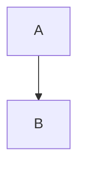

# Supported Markdown Syntax

Complete reference for markdown features supported by `/article-to-html`.

## Standard Markdown

### Headers

```markdown
# Heading 1
## Heading 2
### Heading 3
#### Heading 4
```

**HTML output:**
```html
<h1>Heading 1</h1>
<h2>Heading 2</h2>
<h3>Heading 3</h3>
<h4>Heading 4</h4>
```

---

### Emphasis

```markdown
**Bold text**
__Also bold__

*Italic text*
_Also italic_

***Bold and italic***
___Also bold and italic___

~~Strikethrough~~
```

**HTML output:**
```html
<strong>Bold text</strong>
<strong>Also bold</strong>

<em>Italic text</em>
<em>Also italic</em>

<strong><em>Bold and italic</em></strong>
<strong><em>Also bold and italic</em></strong>

<del>Strikethrough</del>
```

---

### Links

```markdown
[Link text](https://example.com)
[Link with title](https://example.com "Title text")
```

**HTML output:**
```html
<a href="https://example.com">Link text</a>
<a href="https://example.com">Link with title</a>
```

---

### Images

```markdown


```

**HTML output (with public GitHub Pages URLs):**
```html


```

---

### Lists

**Unordered:**
```markdown
- Item one
- Item two
  - Nested item
- Item three
```

**Ordered:**
```markdown
1. First item
2. Second item
3. Third item
```

**HTML output:**
```html
<ul>
  <li>Item one</li>
  <li>Item two</li>
  <li>Item three</li>
</ul>

<ol>
  <li>First item</li>
  <li>Second item</li>
  <li>Third item</li>
</ol>
```

---

### Code

**Inline:**
```markdown
Use `code` in sentences.
```

**Blocks:**
````markdown
```python
def hello():
    print("Hello, world!")
```
````

**HTML output:**
```html
<code>code</code>

<pre><code>def hello():
    print("Hello, world!")</code></pre>
```

---

### Blockquotes

```markdown
> This is a quote.
> It can span multiple lines.
```

**HTML output:**
```html
<blockquote>This is a quote. It can span multiple lines.</blockquote>
```

---

### Horizontal Rules

```markdown
---
***
```

**HTML output:**
```html
<hr>
<hr>
```

---

## Obsidian Extensions

### Callouts

```markdown
> [!note]
> This is a note callout.

> [!warning] Custom Title
> This is a warning with custom title.

> [!tip]
> Multiple lines
> in one callout.
```

**HTML output:**
```html
<div class="callout callout-note" style="border-left: 4px solid #3b82f6; background: #3b82f610; padding: 16px; margin: 16px 0; border-radius: 4px;">
  <div style="font-weight: bold; color: #3b82f6; margin-bottom: 8px;">Note</div>
  <div>This is a note callout.</div>
</div>
```

**Supported callout types:**

| Type | Color | Use Case |
|------|-------|----------|
| `note`, `info`, `todo` | Blue | General information |
| `abstract`, `summary`, `tldr` | Teal | Summaries |
| `tip`, `hint`, `important` | Cyan | Helpful tips |
| `success`, `check`, `done` | Green | Completed items |
| `question`, `help`, `faq` | Yellow | Questions |
| `warning`, `caution`, `attention` | Orange | Warnings |
| `failure`, `fail`, `missing`, `danger`, `error`, `bug` | Red | Errors |
| `example` | Purple | Examples |
| `quote`, `cite` | Gray | Citations |

---

### Wikilinks

```markdown
[[Note Name]]
[[Note Name|Display Text]]
```

**HTML output (converted to plain text):**
```html
Note Name
Display Text
```

**Note:** Wikilinks are converted to plain text since Substack/Medium don't support internal wiki-style links.

---

### Highlights

```markdown
This is ==highlighted text== in a sentence.
```

**HTML output:**
```html
This is <mark>highlighted text</mark> in a sentence.
```

**Styling:**
- Yellow background (`#fef08a`)
- Slight padding and border radius
- Preserves readability

---

### Comments

```markdown
This is public text.
%%This is a private comment.%%
More public text.
```

**HTML output:**
```html
This is public text.
More public text.
```

**Note:** Comments are completely removed from output. Use for:
- Draft notes
- TODOs
- Editor comments
- Content not ready for publication

---

### Task Lists

```markdown
- [ ] Unchecked task
- [x] Checked task
- [ ] Another unchecked task
```

**HTML output:**
```html
<ul class="task-list">
  <li class="task-list-item"><input type="checkbox" disabled> Unchecked task</li>
  <li class="task-list-item"><input type="checkbox" checked disabled> Checked task</li>
  <li class="task-list-item"><input type="checkbox" disabled> Another unchecked task</li>
</ul>
```

**Note:** Checkboxes are disabled (not interactive) in the HTML output.

---

### Image Sizing

```markdown
![[image.png|300]]
![[large-image.png|600]]
```

**HTML output (size directive removed):**
```html


```

**Note:** Size is stripped because Substack/Medium handle image sizing automatically.

---

## Unsupported Features

These Obsidian features are NOT converted (will appear as plain text or be removed):

### Dataview Queries
```markdown
```dataview
TABLE file.name FROM "folder"
```
```

**Reason:** Dynamic queries don't work in static HTML.

### Embedded Notes
```markdown
![[Other Note]]
```

**Reason:** Embedding full notes would create massive HTML files.

### LaTeX Math
```markdown
$$
E = mc^2
$$
```

**Reason:** Requires MathJax/KaTeX library not available in copy-paste HTML.

**Workaround:** Use images of equations or plain text.

### Mermaid Diagrams
```markdown

```

**Reason:** Requires Mermaid.js library.

**Workaround:** Export diagram as image, include as ``.

### Canvas/Excalidraw
Obsidian's visual canvases can't be converted.

**Workaround:** Export as image.

---

## Best Practices

### For Substack
✅ **Works great:**
- Headers, bold, italic, links
- Images from public URLs
- Callouts (styled boxes)
- Code blocks
- Lists

❌ **Avoid:**
- Complex nested lists
- LaTeX math
- Embedded videos (use links instead)

### For Medium
✅ **Works great:**
- All standard markdown
- Images
- Code blocks
- Simple formatting

⚠️ **Simplified:**
- Callouts (lose custom colors)
- Task lists (become plain bullets)

❌ **Avoid:**
- Custom HTML/CSS (stripped by Medium)

### For LinkedIn
✅ **Works great:**
- Headers, paragraphs
- Bold, italic
- Links
- Images

⚠️ **Simplified:**
- Code blocks (plain text)
- Lists (basic formatting)

❌ **Avoid:**
- Complex formatting
- Multiple images (LinkedIn limits image count)
- Callouts (too complex for LinkedIn)

---

## Testing Your Markdown

**Preview locally:**
```bash
cd [blog-path]
npx quartz build --serve
```

Visit http://localhost:8080/articles/[slug]/ to see how it renders.

**What you see in Quartz ≈ What you get in HTML converter.**

**Exceptions:**
- Quartz might support features the HTML converter doesn't
- Substack/Medium may simplify some styling

**Always test:**
1. Convert to HTML
2. Paste into target platform
3. Check images load
4. Verify formatting looks good
5. Adjust markdown if needed
